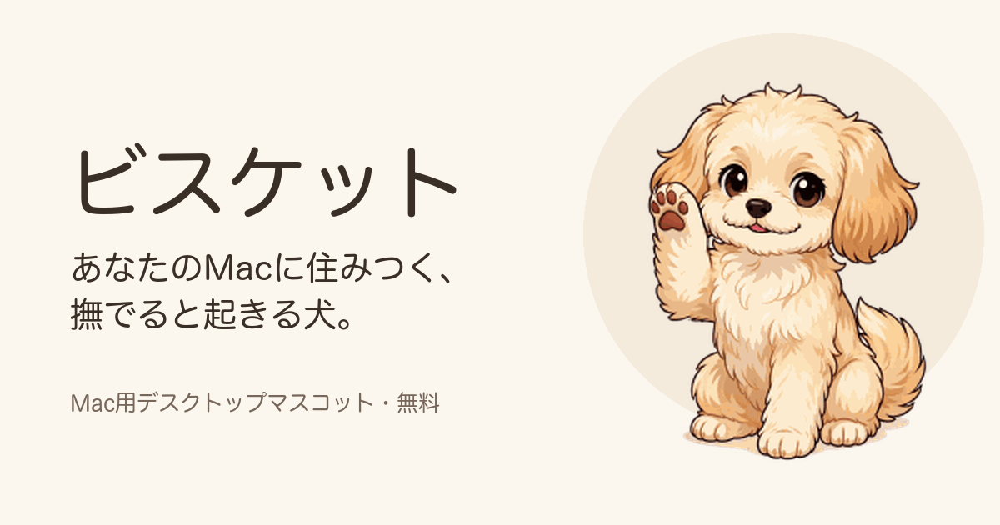

# ビスケット

あなたのMacに住みつく、撫でると起きる犬。

**▶ [サイトで撫でてみる](https://fcpanna0328-create.github.io/dog-desktop-pet/)** ・ **⬇ [ダウンロード(Mac用・無料)](https://github.com/fcpanna0328-create/dog-desktop-pet/releases/latest)**

## 0.2.0 で増えたこと

- 撫でるとハート、眠るとZzzと寝言、足もとからシャボン玉（春は桜、冬は雪）
- 時間帯でしゃべる（朝「おはよう！」、昼「おやつちょーだい」「お散歩行こっ」、夜「ねむい…」など）
- 動きに合わせた効果音（ゴロン・くるっ・タタタッ・ぱふっ）
- 新しいポーズ7つ（ごろん・首かしげ・うれしい・伏せ・抱っこして・尻尾ふりふり・おすまし）
- メニューバーの「動きを見る」から、好きな動きをいつでも見られる
- メニューバーの「エフェクト」で、ハートや吹き出しをまとめてオン/オフ

## どんなアプリ?

- **ふだんは寝ています。** 画面のすみで丸まっていて、ときどき起きてあくびをしたり、前足をなめたりします。
- **撫でると起きます。** カーソルを乗せると目を覚まして、お手をしたり、転がったり、おじぎをしたり。しぐさは12種類。カーソルが離れると、その場でまた眠ります。
- **じゃまをしません。** メニューバーの犬のアイコンから、いつでも隠せます。Dockにも出ません。ドラッグで好きな場所に連れていけます。

## 入れかた

1. [リリースページ](https://github.com/fcpanna0328-create/dog-desktop-pet/releases/latest)から `Biscuit-x.x.x.dmg` をダウンロードします。
2. ダウンロードした `.dmg` を開いて、中の Biscuit をアプリケーションフォルダにドラッグします。
3. はじめて開くときに「開発元を確認できません」と出たら、アイコンを右クリックして「開く」を選んでください。一度許可すれば、次からはふつうに開けます。

## 動作環境

Intel搭載のMac向けに作っています。Appleシリコン搭載のMacでは、はじめて開くときにRosettaのインストールを求められることがあります。Windows版は準備中です。

## 開発者の方へ

ビルドの方法や、開発中に踏んだ落とし穴(日本語のアプリ名だと起動直後に落ちる問題、撫でてもカーソルが手の形にならない問題など)は [DEVELOPMENT.md](DEVELOPMENT.md) にまとめています。

紹介サイトは `docs/` フォルダにあり、GitHub Pages で公開しています。
